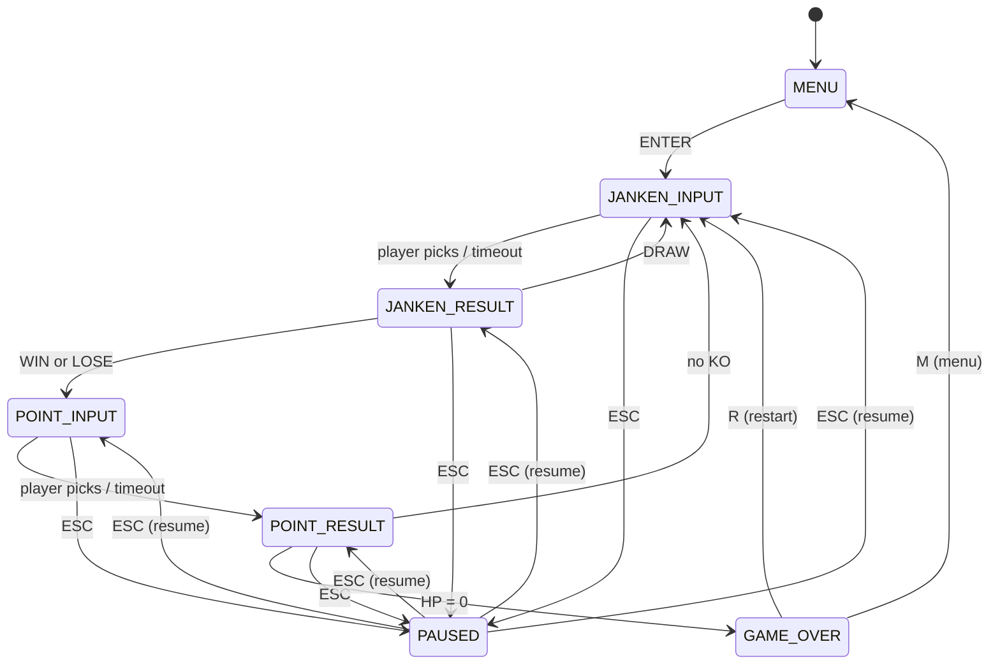
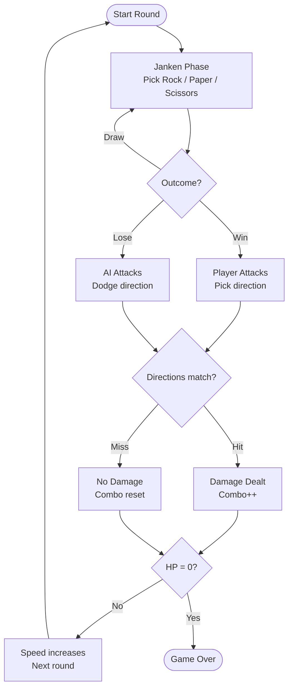
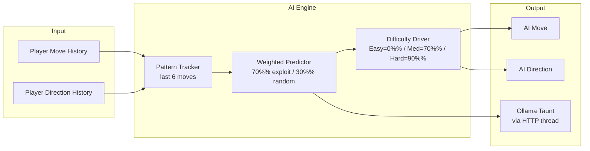

# 🎮 Janken Duel

> **Simple to learn, hard to master, fast to replay.**

A fast-paced reaction arcade game combining **Rock–Paper–Scissors** with **direction-based dodging**, inspired by the Japanese *Janken + Acchi Muite Hoi* mechanic. Beat the AI by predicting its moves and reacting faster than it can.

---

## 📸 Screenshots

> _Screenshots coming soon._

---

## 🕹️ Gameplay

Each round has two phases:

**1. Janken Phase** — Pick Rock, Paper, or Scissors before the timer runs out. The winner becomes the attacker.

**2. Pointing Phase** — The attacker picks a direction. The defender must dodge by choosing a *different* direction in time.

A **hit** deals damage. Land **3 consecutive hits** for bonus damage. Lose all HP and it's game over.

---

## 🎯 Controls

| Key             | Action                   |
| --------------- | ------------------------ |
| `1` / `2` / `3` | Rock / Paper / Scissors  |
| `↑` `↓` `←` `→` | Pick direction           |
| `ESC`           | Pause / Resume           |
| `R`             | Restart (game over)      |
| `M`             | Back to menu (game over) |
| `T`             | Toggle Ollama AI taunts  |
| `S`             | Toggle sound             |

---

## ⚙️ Features

- **State machine** driven game loop
- **Speed scaling** — rounds get faster as the game progresses
- **Combo system** — consecutive hits build a streak, every 3rd hit deals bonus damage
- **Smart AI** — tracks your move history and predicts patterns (Easy / Medium / Hard)
- **Ollama AI taunts** — LLM-powered trash talk via local Ollama instance
- **Procedural sound** — all SFX generated at runtime with numpy, no audio files needed
- **Screen shake + flash** — visual feedback on hits
- **Session score tracker** — win/loss record across games
- **Pause menu** — full controls reference

---

## 🗺️ Game State Machine



---

## 🔁 Round Flow



---

## 🤖 AI Architecture



---

## 🏗️ Project Structure

```
janken-duel/
├── main.py                 # Game loop, rendering, input handling
├── game/
│   ├── state_manager.py    # State enum + transition logic
│   ├── janken.py           # Rock/Paper/Scissors logic
│   ├── pointing.py         # Direction input + resolve
│   ├── ai.py               # Pattern-tracking AI engine
│   ├── effects.py          # Screen shake + flash overlay
│   ├── combo.py            # Combo tracker + bonus damage
│   ├── score.py            # Session win/loss tracker
│   ├── speed.py            # Round speed scaling
│   ├── sounds.py           # Procedural SFX engine
│   └── taunts.py           # Ollama taunt integration
├── assets/                 # (reserved for future sprites)
├── docker-compose.yml      # Ollama local LLM server
└── README.md
```

---

## 🚀 Setup

### Requirements

- Python 3.11+
- [uv](https://github.com/astral-sh/uv)

### Install & Run

```bash
git clone https://github.com/yourname/janken-duel
cd janken-duel
uv sync
uv run main.py
```

### Optional: Ollama AI Taunts

```bash
# Start Ollama with Docker
docker compose up -d
docker exec -it ollama ollama pull llama3.2

# Toggle taunts in-game with T
```

---

## 🧠 Difficulty Levels

| Level  | Janken Exploit | Direction Exploit | Description              |
| ------ | -------------- | ----------------- | ------------------------ |
| Easy   | 0%             | 0%                | Fully random — forgiving |
| Medium | 70%            | 65%               | Learns after 3 rounds    |
| Hard   | 90%            | 85%               | Highly adaptive — brutal |

---

## ⚡ Speed Scaling

| Round | Janken Window | Direction Window | Result Delay |
| ----- | ------------- | ---------------- | ------------ |
| 1     | 5.0s          | 3.0s             | 1.5s         |
| 4     | 4.7s          | 2.8s             | 1.4s         |
| 8     | 4.4s          | 2.4s             | 1.3s         |
| 16+   | 1.5s          | 0.8s             | 0.4s         |

---

## 🔮 Roadmap

- [ ] Special attacks
- [ ] Character system with unique stats
- [ ] Local multiplayer (P1 vs P2)
- [ ] Sprite animations
- [ ] Particle effects
- [ ] Leaderboard / save progress
- [ ] Speed mode toggle

---

## 📄 License

MIT